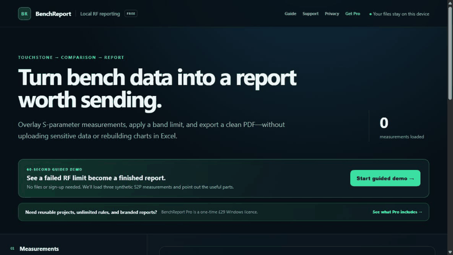

# BenchReport

[](https://github.com/edwarddeakin06-maker/benchreport/actions/workflows/test.yml)

**Local-first Touchstone comparison, RF acceptance analysis, and measurement reporting.**

[Open the free application](https://edwarddeakin06-maker.github.io/benchreport/) · [Get BenchReport Pro](https://edwarddeakin06-maker.github.io/benchreport/pro/) · [Read the user guide](https://edwarddeakin06-maker.github.io/benchreport/guide/) · [Check supported formats](https://edwarddeakin06-maker.github.io/benchreport/formats/)



BenchReport loads one-port and two-port Touchstone measurements directly in the browser. It compares traces, applies reusable acceptance rules, calculates RF statistics, and produces a structured report without uploading source measurement files.

## Why BenchReport

- Measurement files remain on the user's device.
- Multiple `.s1p` and `.s2p` measurements can be overlaid and compared.
- Named limit rules produce a measurement-by-rule pass/fail matrix.
- Worst-case values include the exact sampled frequency.
- S21 statistics include peak insertion loss, 3 dB bandwidth, and centre frequency.
- Traces can be renamed, recoloured, hidden, or selected as the golden reference.
- Complete projects can be saved as portable `.brp` files and reopened later.
- Reports support a company logo, DUT, project, report ID, engineer, and notes.
- The application can be installed as a PWA and used offline after its first successful load.

## Free and Pro editions

The public browser edition remains free and processes up to three measurements with one acceptance rule. [BenchReport Pro](https://edwarddeakin06-maker.github.io/benchreport/pro/) is the local Windows edition and adds unlimited measurements and rules, reusable templates, portable projects, company branding, and complete multi-rule reports.

BenchReport Pro is available for **£29 as a one-time licence**, with automatic installer delivery through Gumroad. The paid installer is deliberately not attached to the public repository.

## Quick evaluation

1. Open the [live application](https://edwarddeakin06-maker.github.io/benchreport/).
2. Select **Load synthetic filter samples**.
3. Review the two passing units and the deliberately degraded unit.
4. Hide the degraded measurement and observe the project recalculate to PASS.
5. Select **Export / print report** and choose **Save as PDF**.

All included measurements and logos are synthetic. They contain no employer, customer, defence, or real device data.

## Supported input

- Touchstone `.s1p` and `.s2p`
- DB / angle, magnitude / angle, and real / imaginary representations
- Hz, kHz, MHz, and GHz option-line units
- Touchstone 1.0-style two-port ordering: S11, S21, S12, S22

Malformed numeric data, invalid option lines, and invalid frequencies are rejected with a clear error. Duplicate frequencies are collapsed deterministically and reported as a warning.

## Run locally

Install Node.js 18 or later:

```powershell
npm start
```

Open `http://localhost:4173`.

## Desktop development

Install development dependencies and launch the Pro shell:

```powershell
npm install
npm run desktop
```

Build the Windows installer:

```powershell
npm run dist:win
```

The installer is written to `dist/` and is excluded from Git. Public releases should not include the Pro installer unless they are intentionally being used for paid fulfilment.

## Test

```powershell
npm test
```

Tests run automatically on GitHub for pushes and pull requests.

## Engineering limitations

BenchReport is analysis and documentation software, not a calibrated instrument or an approved test process. It does not currently provide:

- Touchstone 2.0 matrix-order support
- More than two ports
- Noise parameters
- De-embedding or calibration
- Interpolation at acceptance-band boundaries
- Measurement uncertainty
- Time-domain transforms
- Instrument control
- Cryptographically signed report records

Results must be reviewed by a competent engineer against the source measurement and applicable procedures.

## Privacy

Touchstone parsing, charting, rule evaluation, project generation, and report generation occur in the browser. Templates use browser-local storage. Saved `.brp` files may contain the complete measurement dataset and should be handled according to its sensitivity.

See the complete [privacy page](https://edwarddeakin06-maker.github.io/benchreport/privacy/).
